# copy-drive-folder
- A simple way to copy Google Drive folders using Colab.
- 使用 Google Colab 複製其他人共享給我的 Google Drive 資料夾。

## Step 1 步驟 1
- Create directory: "My Drive/Colab Notebooks/_Copy_Drive_Folder" in your Google Drive.
- 請在自己的 Google Drive 建立資料夾目錄：【我的雲端硬碟/Colab Notebooks/_Copy_Drive_Folder】。

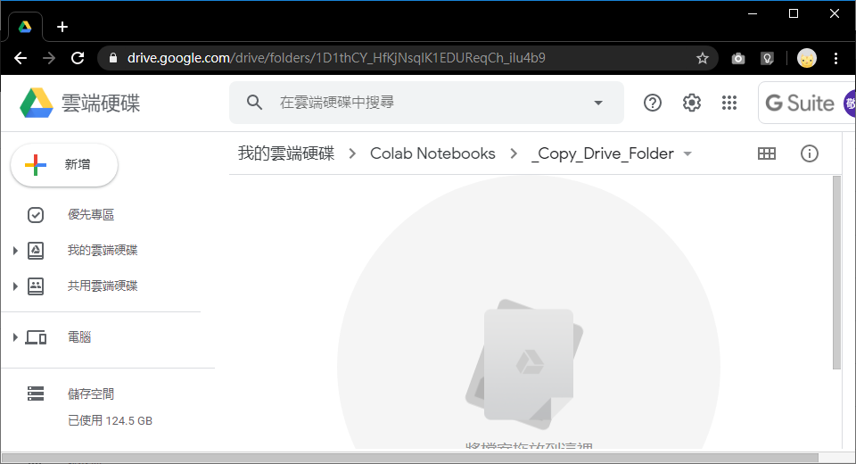

## Step 2 步驟 2
- Create the shared folder shortcut to Google Drive's "My Drive/Colab Notebooks/_Copy_Drive_Folder".
- 請將其他人與您共享的資料夾，建立捷徑至剛建立的 Google Drive 資料夾【我的雲端硬碟/Colab Notebooks/_Copy_Drive_Folder】內。

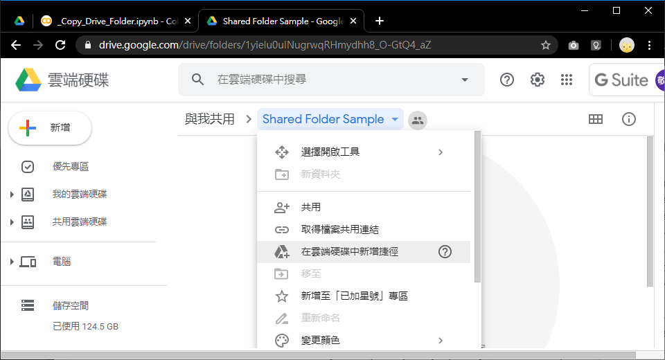

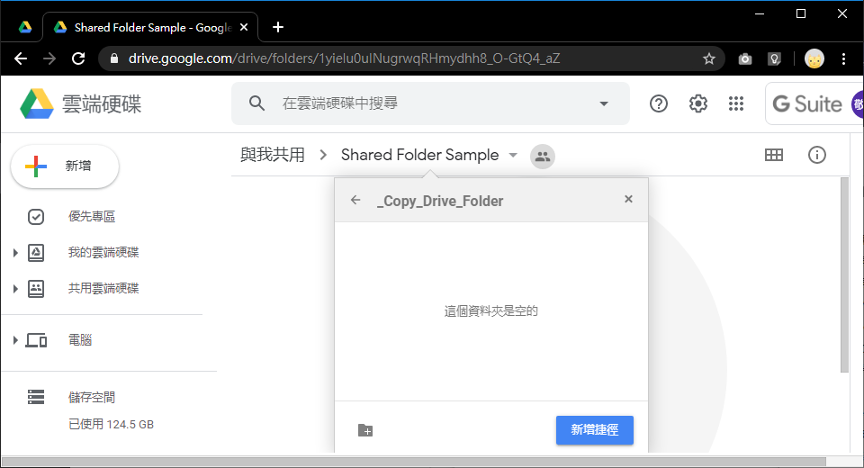

## Step 3 步驟 3
- Copy the shared folder shortcut name.
- 請複製剛才建立的捷徑名稱。

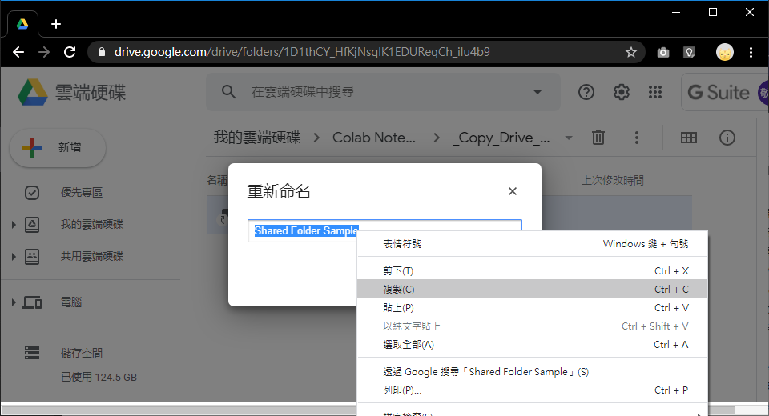

## Step 4 步驟 4
- Upload "_Copy_Drive_Folder.ipynb" file to Google Drive's "My Drive/Colab Notebooks/_Copy_Drive_Folder" folder from this project.
- 請將本專案的【_Copy_Drive_Folder.ipynb】檔案上傳到 Google Drive 資料夾【我的雲端硬碟/Colab Notebooks/_Copy_Drive_Folder】內。

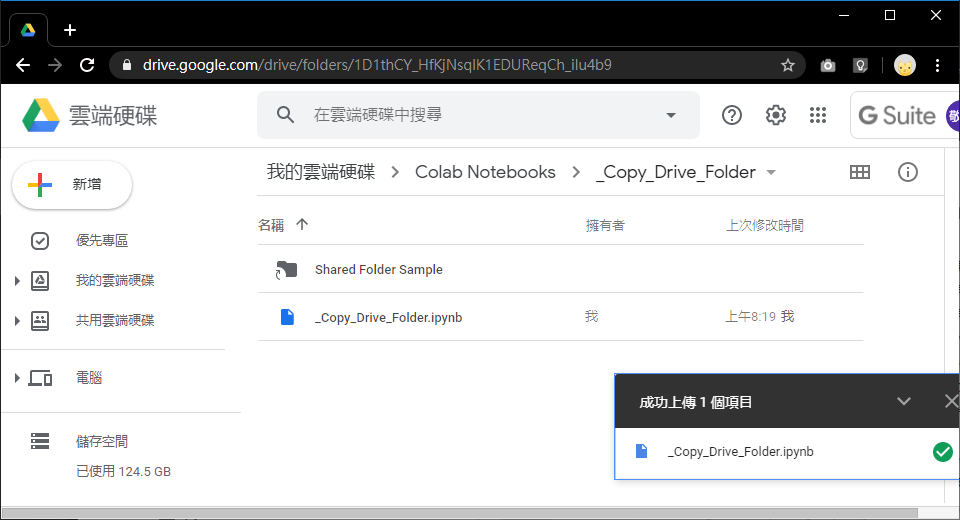

## Step 5 步驟 5
- Open the "_Copy_Drive_Folder.ipynb" with [Google Colaboratory].
- 請使用【Google Colaboratory】開啟「_Copy_Drive_Folder.ipynb」檔案。

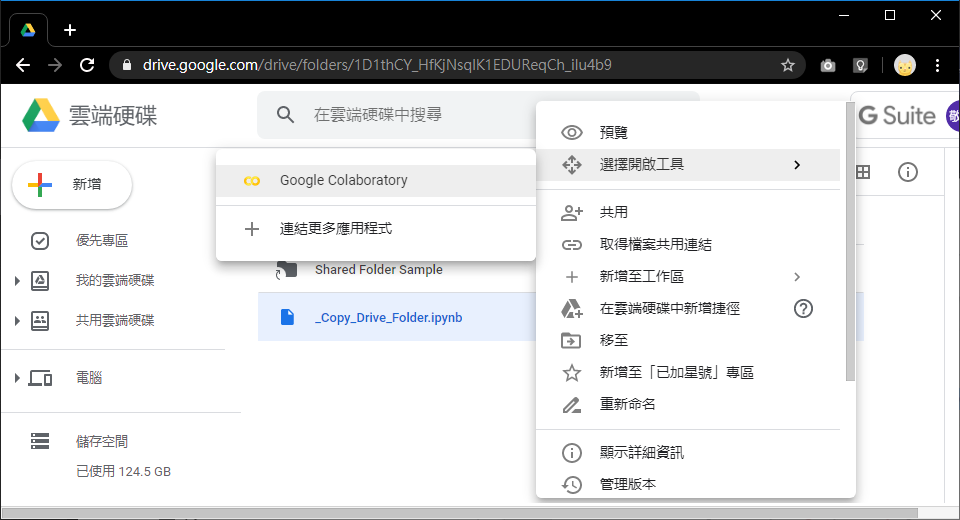

## Step 6 步驟 6
- Paste the "shortcut name" from step 3 to 'TARGET' variable.
- 請將步驟 3 複製的捷徑名稱貼在程式碼中的 TARGET 變數後方。

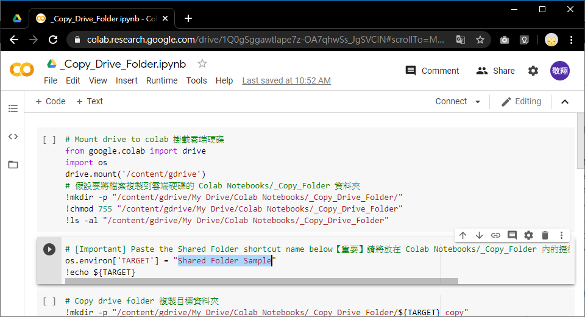

## Step 7 步驟 7
- Execute the all Colab code.
- 執行 Colab 的所有程式碼。

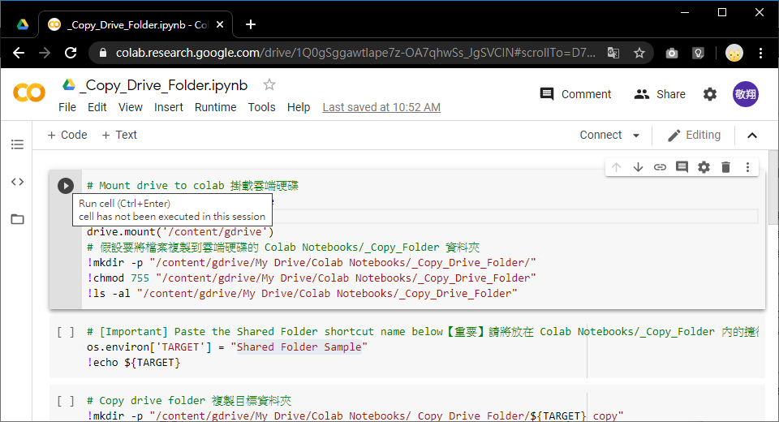

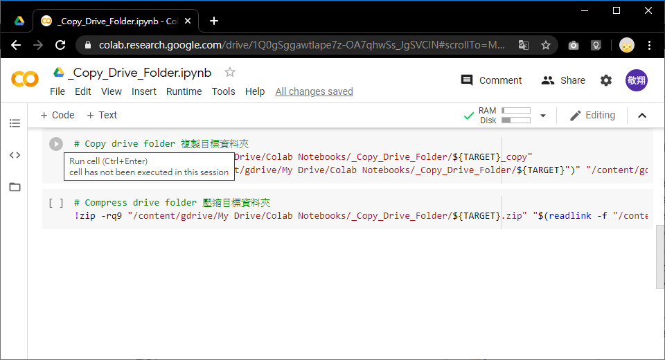

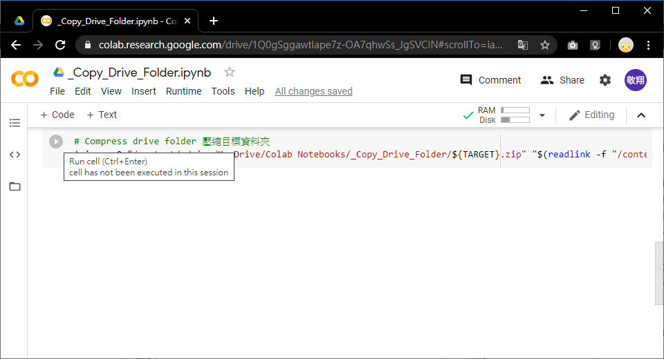

## Step 8 步驟 8
- The Shared Folder will be copied and compressed in your "My Drive/Colab Notebooks/_Copy_Drive_Folder".
- 即會看到與您共享的資料夾、以及資料夾的打包檔已複製到【我的雲端硬碟/Colab Notebooks/_Copy_Drive_Folder】內。

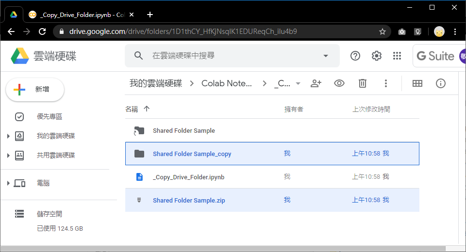

# License
THE SOFTWARE IS PROVIDED "AS IS", WITHOUT WARRANTY OF ANY KIND, EXPRESS OR
IMPLIED, INCLUDING BUT NOT LIMITED TO THE WARRANTIES OF MERCHANTABILITY,
FITNESS FOR A PARTICULAR PURPOSE AND NONINFRINGEMENT. IN NO EVENT SHALL THE
AUTHORS OR COPYRIGHT HOLDERS BE LIABLE FOR ANY CLAIM, DAMAGES OR OTHER
LIABILITY, WHETHER IN AN ACTION OF CONTRACT, TORT OR OTHERWISE, ARISING FROM,
OUT OF OR IN CONNECTION WITH THE SOFTWARE OR THE USE OR OTHER DEALINGS IN THE
SOFTWARE.
